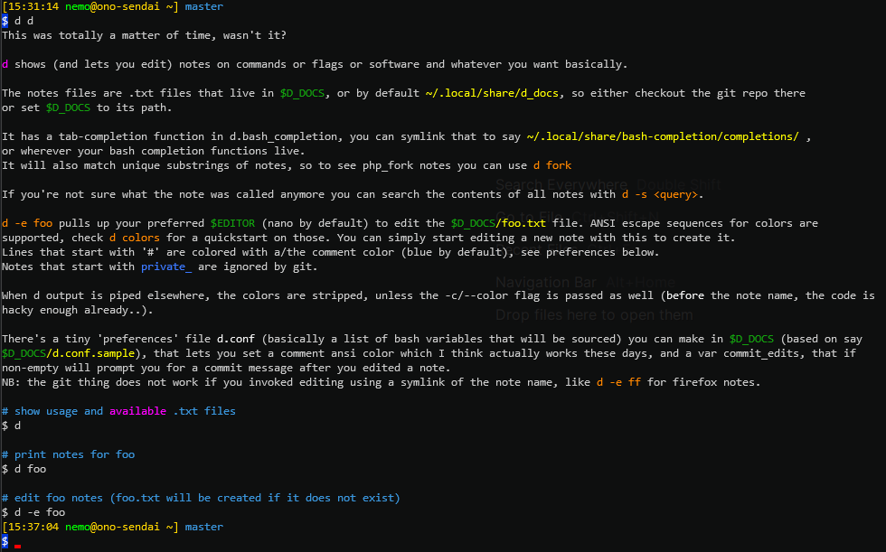

    d[ocs]

I keep forgetting flags/options for rarely used commands so I put them in txt files that I can throw on the screen.
Often the mere act of writing the stuff down and saving it already makes me remember it and then this utility makes itself irrelevant but, you know.

Popular community ones are https://github.com/tldr-pages/tldr and https://github.com/cheat/cheat
I use cheat too, but had already written d and it has more personal things I forget, so..
See also https://www.commandlinefu.com/commands/browse

Contents:
- 'd' contains the bash function. It looks for the txt files in ~/.my_stuff/docs by default, or if set, in $D_DOCS.
- d.bash_completion makes tab-completion work, source it, or symlink to it in (by default, per XDG) ~/.local/share/bash-completion/completions
- d.conf has, currently, one variable *nods* for the color of commented lines.
- bunch of .txt files

Usage:

    d <name>    # like, "$ d dig" should show the colorized version of $D_DOCS/dig.txt
                # it tries to intelligently guess what you wanted from substrings too, and if completed a full name from it will show that on line 1
    d -e <name> # lets you edit it, or create new files. Use ansi color sequences for pretty colors (see 'd colors')
    d -s query  # searches for whatever and lists files
    the '-c' flag will force color even when cat'ing to another process or file.

In a fit of procrastination, boredom and sub-zero motivation for actual work I added a d note on itself; you can do  
`$ d d`  
now.

